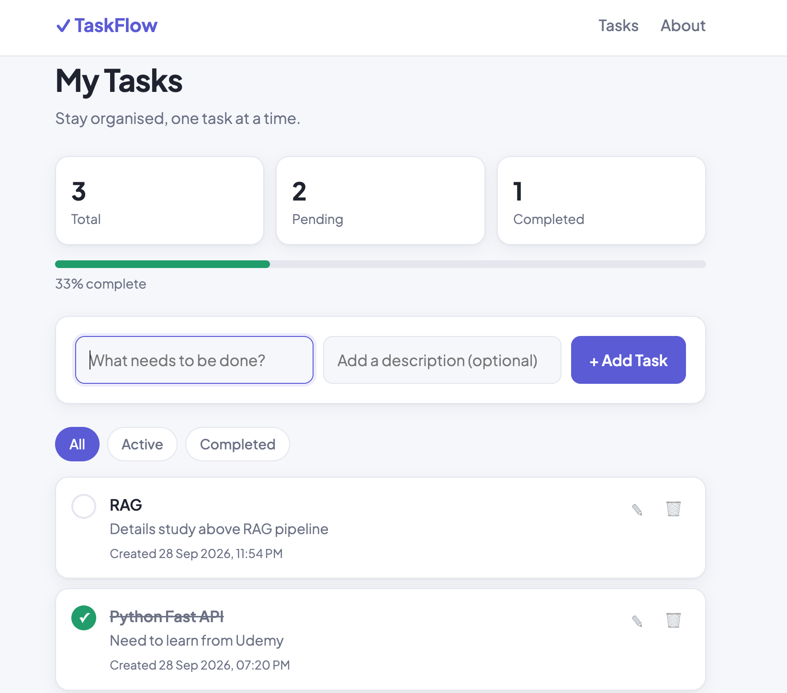

# TaskFlow – Flask Todo App

A clean and simple task management web app built with **Python, Flask and MySQL**.

I built this project to learn how a real Flask application is structured, not just to make a todo list. It uses the patterns that are used in production Flask apps, like the application factory, blueprints, an ORM and database migrations.

## Screenshots



## Features

- **Add, edit, complete and delete tasks** (full CRUD)
- **Filter tasks** by All, Active or Completed
- **Live stats** showing total, pending and completed tasks, with a progress bar
- **Automatic dark mode** that follows your system setting
- **Responsive design** that works on mobile and desktop
- **Timezone-aware dates:** times are saved in UTC and shown in IST

## Tech Stack

| Part | Technology |
|---|---|
| Backend | Python, Flask |
| Database | MySQL / MariaDB |
| ORM | SQLAlchemy (Flask-SQLAlchemy) |
| Migrations | Flask-Migrate (Alembic) |
| Templates | Jinja2 |
| Frontend | HTML, CSS (no framework) |
| Config | python-dotenv |

## Key Concepts Used

- **Application Factory pattern:** the app is created inside a `create_app()` function, so it can run with different settings (development, production).
- **Blueprints:** routes are split into modules (`main` and `tasks`) to keep the code organised.
- **SQLAlchemy ORM:** the database table is a Python class (`Task`), so no raw SQL is needed for normal work.
- **Database migrations:** changes to the database structure are tracked in version files, so data is never lost.
- **Environment variables:** passwords and secret keys are kept in a `.env` file that is never pushed to GitHub.
- **Post/Redirect/Get (PRG) pattern:** after a form is submitted, the page redirects, so refreshing the page does not create duplicate tasks.
- **Template inheritance:** all pages extend one `base.html`, so the navbar and footer are written only once.
- **Custom Jinja filter:** a `localtime` filter converts UTC time to the local timezone.
- **Security basics:** server-side validation, Jinja2 autoescaping to prevent XSS, and data-changing actions only allowed through POST requests.

## Project Structure

```
Flask-todoApp/
├── app/
│   ├── __init__.py        # App factory (create_app)
│   ├── extensions.py      # Database and migration objects
│   ├── models.py          # Task model (database table)
│   ├── routes.py          # Main routes (home, about)
│   ├── tasks.py           # Task routes (CRUD)
│   ├── static/
│   │   └── css/
│   │       └── style.css  # All styles, including dark mode
│   └── templates/
│       ├── base.html      # Main layout (navbar, footer)
│       ├── about.html
│       └── tasks/
│           ├── index.html # Task list page
│           └── edit.html  # Edit task page
├── migrations/            # Database migration files
├── config.py              # App settings
├── run.py                 # Starts the app
├── requirements.txt       # Python packages
└── .env.example           # Example environment variables
```

## Routes

| URL | Method | What it does |
|---|---|---|
| `/tasks/` | GET | Show all tasks (supports `?filter=active` or `?filter=completed`) |
| `/tasks/create` | POST | Add a new task |
| `/tasks/<id>/edit` | GET, POST | Show the edit form / save changes |
| `/tasks/<id>/toggle` | POST | Mark a task as done or not done |
| `/tasks/<id>/delete` | POST | Delete a task |

## How to Run Locally

### What you need

- Python 3.9 or higher
- MySQL or MariaDB (XAMPP works fine)

### Steps

**1. Clone the project**

```bash
git clone https://github.com/nityanandadas-cc/Flask-todoApp.git
cd Flask-todoApp
```

**2. Create and activate a virtual environment**

```bash
python -m venv .venv

# Mac / Linux
source .venv/bin/activate

# Windows
.venv\Scripts\activate
```

**3. Install the packages**

```bash
pip install -r requirements.txt
```

**4. Create the database**

Run this in MySQL (for example in phpMyAdmin's SQL tab):

```sql
CREATE DATABASE todo_db CHARACTER SET utf8mb4 COLLATE utf8mb4_unicode_ci;
CREATE USER 'todo_user'@'localhost' IDENTIFIED BY 'your-password';
GRANT ALL PRIVILEGES ON todo_db.* TO 'todo_user'@'localhost';
FLUSH PRIVILEGES;
```

**5. Set up your environment variables**

Copy the example file:

```bash
cp .env.example .env
```

Open `.env` and fill in your own database details. To create a secret key, run:

```bash
python -c "import secrets; print(secrets.token_hex(32))"
```

**6. Create the database tables**

```bash
flask --app run db upgrade
```

**7. Start the app**

```bash
python run.py
```

Open **http://127.0.0.1:5000** in your browser.

## What's Next

- [ ] Form validation and CSRF protection with Flask-WTF
- [ ] Flash messages (for example, "Task added")
- [ ] Custom 404 and 500 error pages
- [ ] REST API with a JavaScript frontend
- [ ] Deploy the app online

## Author

**Nityananda Das**
GitHub: [@nityanandadas-cc](https://github.com/nityanandadas-cc)
